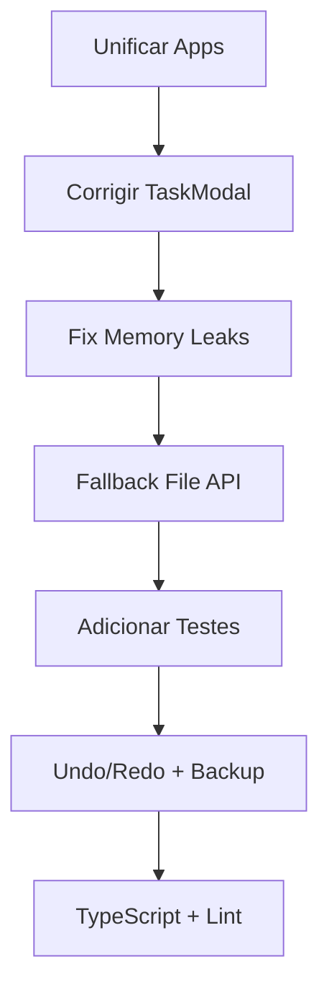

# Análise Técnica do Projeto ProjectGantt

**Data/Hora:** Sexta-feira, 15 de maio de 2026 - 17:45 (BRT)
**Analista:** DeepSeek V4 Flash

---

## Sumário Executivo

Projeto de Gerenciamento de Projetos com Gráfico Gantt, arquitetura Local-First. Tecnologia: Vue 3 + Vuetify + Vite. Utiliza File System Access API para persistência.

---

## 🔴 PROBLEMAS CRÍTICOS

### 1. Duas Versões da Aplicação Conviventes (APP DUPLICADA)

O projeto contém **DOIS aplicativos incompletos**:

| Versão | Arquivos | Status |
|--------|----------|--------|
| **Legacy (Vue 3 CDN)** | `index.html` + `vue_app.js` | ~95% funcional, mais recursos |
| **Refatorada (Vite + Vuetify)** | `src/` + `vite.config.js` | ~40% dos recursos migrados |

**Problemas:**
- `index.html` possui exportação PDF, Wizard de criação, Baseline, Forecast, Holiday Manager, Custom Dialogs, Toasts
- `src/` não tem nenhum desses recursos
- `DashboardModal.vue` referencia `gantt.allTasks` que não existe em `useGantt.js`
- Manter ambas gera duplicação de manutenção e confusão

---

### 2. TaskModal com Campos Incorretos

**Arquivo:** `src/components/TaskModal.vue:18-23`
```javascript
// Usa 'realStart'/'realEnd' que NÃO EXISTEM no objeto tarefa
if (taskData.value.realStart) { ... }
if (taskData.value.realEnd) { ... }
```
**Correto:** Os campos no useGantt.js são `plannedStart`, `plannedEnd`, `actualStart`, `actualEnd`.

**Impacto:** Modal de edição não persiste datas reais corretamente.

---

### 3. Memory Leaks em Ambos os Aplicativos

**`src/App.vue:45-61`** e **`vue_app.js:1249-1266`**:
```javascript
onMounted(() => {
  window.addEventListener('mousemove', ...);
  window.addEventListener('mouseup', ...);
  // NUNCA removidos!
});
```
**Impacto:** Se componente for montado/desmontado, listeners se acumulam na window causando vazamento de memória e múltiplos resizes simultâneos.

---

### 4. Performance do Algoritmo de Schedule (GanttEngine.js)

**Arquivo:** `src/services/GanttEngine.js:55-161`

- Recursão sem memoização para resolução de dependências
- Dois passes completos (baseline + forecast) recalculam tudo
- Com >100 tarefas, complexidade O(n²) com dependências encadeadas
- `getBusinessDayIndex` itera dia por dia (lento para projetos longos)

---

### 5. Dependência Exclusiva de Chrome/Edge

- `window.showDirectoryPicker` só funciona em Chromium
- Nenhum fallback para Firefox/Safari
- `vue_app.js` tem IndexedDB (linha 79-128) mas só para persistir handle, não como fallback funcional

---

### 6. Sem Backup ou Undo

- Arquivos CSV sobrescritos diretamente via `createWritable`
- Nenhuma versão de backup antes de salvar
- Sem undo/redo para operações do usuário

---

## 🟡 PROBLEMAS MÉDIOS

### 7. Inconsistência de Nomenclatura de Campos

| Arquivo | Campo Usado | Campo Correto |
|---------|-------------|---------------|
| `TaskModal.vue:18` | `realStart` | `actualStart` |
| `TaskModal.vue:21` | `realEnd` | `actualEnd` |
| `useGantt.js:83` | Data parsing diferente | Inconsistente com GanttEngine.js |
| `vue_app.js:670` | `mapeamentorealStart` vs `plannedStart` | nomenclaturas diferentes entre CSV header e objeto |

**Impacto:** Usuário edita dados que nunca são persistidos.

---

### 8. Template Syntax Incorreta no ChartArea.vue

**Arquivo:** `src/components/ChartArea.vue:31`
```html
<div v-if="chartMonths.value?.length">
```
No template Vue, `chartMonths` já é desrefenciado automaticamente. Deveria ser:
```html
<div v-if="chartMonths.length">
```

---

### 9. Erro no addToast (index.html:1288)

```javascript
addToast('success', 'Imagem HD (PNG) exportada com sucesso!');
```
**Ordem dos argumentos incorreta.** Definição da função é `addToast(message, type, duration)`.

---

### 10. Dados de Portfolio Duplicados

- `vue_app.js:573` salva `projectOptions` em localStorage
- `vue_app.js:697` também salva `projectMetadata` em localStorage
- `useGantt.js` não utiliza localStorage
- Risco de dados inconsistentes entre sessões

---

### 11. Importações CSS Incorretas

**`src/main.js`:**
```javascript
import 'vuetify/styles'  // Importação direta - pode falhar sem loader CSS
import '@mdi/font/css/materialdesignicons.css'
```

**`index.html:7`** carrega Google Fonts via link externo
**`index.html:9`** carrega jsPDF via CDN (pode falhar offline)

---

### 12. Variável `projectMetadata.value.name` Sem Proteção

**`src/App.vue:74`**:
```javascript
const name = projectMetadata.value.name.replace(/\s+/g, '_');
```
Crasha se `name` for `null` ou `undefined`.

---

### 13. Cycle Detection Incompleta

**`src/services/GanttEngine.js:82`** e **`vue_app.js:724-726`**:
```javascript
if (stack.has(t.id)) { t.start = new Date(projStart); }
```
Só detecta ciclo direto. Cadeias longas de dependência circular podem causar erro ou cálculo incorreto.

---

### 14. Rebuild Completo ao Salvar

**`src/components/TaskModal.vue:42-45`**:
```javascript
saveTasksToDisk().then(() => { loadProject(); });
```
Re-carrega todo o projeto após cada edição. Perde estado visual (scroll, hover, seleção).

---

## 🟢 PONTOS DE MELHORIA

### Código e Arquitetura

| Item | Descrição | Prioridade |
|------|-----------|------------|
| **Unificar apps** | Decidir entre CDN legacy vs Vite+Vuetify e migrar 100% | Alta |
| **TypeScript** | Adicionar tipos para maior segurança e autocomplete | Média |
| **Testes** | Nenhum teste existente - adicionar Vitest | Alta |
| **ESLint/Prettier** | Nenhuma ferramenta de lint configurada | Média |
| **Modularizar constantes** | Extrair `ROW_H`, `BAR_COLORS`, `MONTHS_PT` para constants.js | Baixa |
| **Extract utils** | `parseDate`, `addDays`, `isWorkingDay` duplicados em 3 arquivos | Média |
| **Migalha de pão (breadcrumbs)** | Não há indicação visual de dependências entre tarefas | Baixa |

### UX/UI

| Item | Descrição | Prioridade |
|------|-----------|------------|
| **Loading states** | Sem spinners durante carregamento de arquivos | Alta |
| **Keyboard shortcuts** | Legacy tem, versão Vite não | Média |
| **Offline fallback** | Sem fallback para File System API | Alta |
| **Responsividade** | Gráfico não adaptável para mobile | Média |
| **Acessibilidade (A11y)** | Sem ARIA labels, sem suporte a leitores de tela | Média |
| **Tooltip detalhado** | Legacy tem tooltip rico, ChartArea.vue não implementa | Média |

### Performance

| Item | Descrição | Prioridade |
|------|-----------|------------|
| **Virtual scroll** | >500 tarefas trava o navegador | Média |
| **Debounce syncScroll** | `syncScroll` dispara em cada pixel de scroll | Baixa |
| **shallowRef** | `tasks.value` e `allDays.value` grandes poderiam usar `shallowRef` | Baixa |
| **Memoized getPos** | `getPos` chamada múltiplas vezes para mesma tarefa | Baixa |

### Segurança e Dados

| Item | Descrição | Prioridade |
|------|-----------|------------|
| **CSV Injection** | Valores CSV não sanitizados (ex: `=CMD()`) | Média |
| **Validação de dados** | `parseInt` sem validação de NaN em muitos lugares | Média |
| **Sanitização de filename** | `filename.replace(/\s+/g, '_')` sem remover caracteres especiais | Baixa |
| **Backup automático** | Salvar `.bak` antes de sobrescrever CSV | Média |

### Documentação e DevOps

| Item | Descrição | Prioridade |
|------|-----------|------------|
| **Build/prod** | Vite build gera dist/ mas não há deploy configurado | Baixa |
| **Pipeline CI** | Sem GitHub Actions ou scripts de CI | Baixa |
| **.env** | Sem variáveis de ambiente para configuração | Baixa |
| **CHANGELOG** | Sem histórico de versões | Baixa |
| **CONTRIBUTING** | Sem guia de contribuição | Baixa |

---

## 🔵 OBSERVAÇÕES POSITIVAS

- ✅ **Arquitetura Local-First** bem executada - privacidade total dos dados
- ✅ **Separação de responsabilidades** limpa (composables, services, components)
- ✅ **Vue 3 Composition API** utilizada corretamente
- ✅ **GanttEngine.js** separado da lógica de apresentação - facilita testes
- ✅ **Tema escuro/claro** bem implementado tanto no legacy quanto no Vite
- ✅ **Suporte a feriados** configuráveis com arquivo JSON
- ✅ **Exportação PNG** funcional em ambas versões
- ✅ **Cálculo de baseline/forecast** implementado e funcional
- ✅ **Dashboard KPI** com indicadores de SPI, desvio médio, atrasos
- ✅ **Wizard de criação** de projetos do zero muito completo
- ✅ **Toasts e Custom Dialogs** para feedback ao usuário
- ✅ **PWA-ready** com manifest e service worker (via dist/)
- ✅ **Portfolio de múltiplos projetos** em um único diretório
- ✅ **Upload múltiplo de CSV** com auto-detecção de delimitador

---

## PRIORIDADES DE CORREÇÃO RECOMENDADAS



1. **Imediata** 🔥: Unificar app (decidir entre CDN ou Vite)
2. **Imediata** 🔥: Corrigir TaskModal (campos `actualStart`/`actualEnd`)
3. **Imediata** 🔥: Adicionar cleanup de event listeners (`onUnmounted`)
4. **Alta**: Adicionar fallback File API para Firefox/Safari
5. **Alta**: Adicionar loading spinners e feedback visual
6. **Média**: Migrar para TypeScript com tipagem forte
7. **Média**: Backup automático antes de salvar CSV
8. **Média**: Adicionar testes unitários (Vitest)
9. **Baixa**: ESLint, Prettier, CI/CD
10. **Baixa**: Virtual scroll para >500 tarefas

---

## Checklist de Arquivos Revisados

| Arquivo | Status | Tamanho |
|---------|--------|---------|
| `index.html` | Legacy Vue 3 CDN (completo) | 1412 linhas |
| `vue_app.js` | Vue 3 Setup completa | ~1400+ linhas |
| `src/App.vue` | Vite refatorado | 282 linhas |
| `src/main.js` | Vite entry point | 20 linhas |
| `src/composables/useGantt.js` | Composables | 416 linhas |
| `src/services/GanttEngine.js` | Engine de schedule | 161 linhas |
| `src/components/ChartArea.vue` | Gantt chart | 183 linhas |
| `src/components/TaskList.vue` | Tabela de tarefas | 71 linhas |
| `src/components/TaskModal.vue` | Modal edição | 141 linhas |
| `src/components/DashboardModal.vue` | Dashboard KPI | 225 linhas |
| `src/components/HelloWorld.vue` | Componente template Vite | 95 linhas |
| `src/style.css` | Estilos Vite default | 296 linhas |
| `vite.config.js` | Config Vite | 11 linhas |
| `package.json` | Dependências | 23 linhas |
| `.gitignore` | Ignorados git | 24 linhas |
| `build.py` | Script build auxiliary | 132 linhas |
| `refactor.py` | Script de refatoração | 1030 linhas |
| `README.md` | Documentação | 67 linhas |

---

*Análise gerada pelo assistente DeepSeek V4 Flash (opencode)*