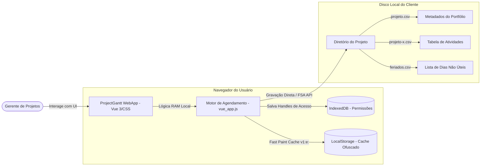

# 📚 Hub de Documentação Técnica — ProjectGantt

Bem-vindo ao **Centro de Documentação Técnica** do **ProjectGantt** (v2.1). Este repositório de documentos consolida toda a especificação de engenharia, decisões arquiteturais, fluxos lógicos e diretrizes de conformidade de segurança e implantação da aplicação.

> [!NOTE]
> O **ProjectGantt** é uma ferramenta corporativa de gerenciamento de projetos baseada no modelo **Local-First**. Toda a lógica de negócios, renderização gráfica e persistência ocorrem exclusivamente no lado do cliente (Client-Side), garantindo soberania total dos dados e latência nula.

---

## 🗺️ Mapa de Documentação (13 Diretórios Principais)

Abaixo está o índice estruturado de toda a documentação técnica do sistema. Cada link aponta para o respectivo arquivo de especificação detalhada (disponível tanto via links absolutos da plataforma quanto relativos para navegação offline/Git).

| # | Área | Descrição do Conteúdo | Links de Acesso |
|---|------|------------------------|-----------------|
| 1 | **Arquitetura** | Topologia do sistema, filosofia Local-First, separação de responsabilidades e estrutura monolítica. | [overview.md](file:///c:/Users/rcbon/OneDrive/Apps/ProjectGantt/docs/architecture/overview.md) / [Relativo](./architecture/overview.md) |
| 2 | **Camada Local (Backend)** | Integração com a File System Access API, persistência de handles de diretórios e políticas de backup `.bak`. | [persistence_layer.md](file:///c:/Users/rcbon/OneDrive/Apps/ProjectGantt/docs/backend/persistence_layer.md) / [Relativo](./backend/persistence_layer.md) |
| 3 | **Interface (Frontend)** | Reatividade do Vue 3 CDN, grid Vanilla CSS responsivo, zoom em três níveis e sincronização de scrolls. | [ui_layout.md](file:///c:/Users/rcbon/OneDrive/Apps/ProjectGantt/docs/frontend/ui_layout.md) / [Relativo](./frontend/ui_layout.md) |
| 4 | **Especificação de API** | Dicionário de dados, cabeçalhos de CSV e especificações de `portfolio.json`, `feriados.json` e tarefas. | [file_formats.md](file:///c:/Users/rcbon/OneDrive/Apps/ProjectGantt/docs/api/file_formats.md) / [Relativo](./api/file_formats.md) |
| 5 | **Banco de Dados & Cache** | Estruturas operacionais do IndexedDB, LocalStorage e cache rápido com ofuscação Base64 (`v1:e:`). | [cache_db.md](file:///c:/Users/rcbon/OneDrive/Apps/ProjectGantt/docs/database/cache_db.md) / [Relativo](./database/cache_db.md) |
| 6 | **Segurança & Hardening** | Modelo de sandboxing, defesas ativas contra Injeção de CSV (CSV Injection) e sanitização contra XSS. | [hardening.md](file:///c:/Users/rcbon/OneDrive/Apps/ProjectGantt/docs/security/hardening.md) / [Relativo](./security/hardening.md) |
| 7 | **Implantação & Deploy** | Configurações do servidor Vite, requisitos corporativos de Origem Segura (HTTPS) e build estático zero overhead. | [deployment_guide.md](file:///c:/Users/rcbon/OneDrive/Apps/ProjectGantt/docs/deploy/deployment_guide.md) / [Relativo](./deployment_guide.md) |
| 8 | **Motor de Agendamento** | Algoritmos matemáticos de propagação em cascata (`calculateSchedule()`), links FS/SS e detecção de ciclos. | [scheduling_engine.md](file:///c:/Users/rcbon/OneDrive/Apps/ProjectGantt/docs/business-rules/scheduling_engine.md) / [Relativo](./business-rules/scheduling_engine.md) |
| 9 | **Fluxos de Controle** | Ciclo de vida da aplicação (onMounted), transição de estados de arquivos e fluxos de sincronização. | [state_transitions.md](file:///c:/Users/rcbon/OneDrive/Apps/ProjectGantt/docs/flows/state_transitions.md) / [Relativo](./flows/state_transitions.md) |
| 10 | **Catálogo de Diagramas** | Consolidação de diagramas C4 Model, máquinas de estado, fluxos de dados e lógica visual do Gantt. | [diagrams.md](file:///c:/Users/rcbon/OneDrive/Apps/ProjectGantt/docs/diagrams/diagrams.md) / [Relativo](./diagrams/diagrams.md) |
| 11 | **Garantia de Qualidade (QA)** | Matriz de testes manuais, receitas automatizadas com Playwright, homologação de dados e carga de estresse. | [testing_guide.md](file:///c:/Users/rcbon/OneDrive/Apps/ProjectGantt/docs/testing/testing_guide.md) / [Relativo](./testing/testing_guide.md) |
| 12 | **Requisitos & Restrições** | Mapeamento detalhado de requisitos funcionais, não funcionais e restrições técnicas do monolito. | [requirements_spec.md](file:///c:/Users/rcbon/OneDrive/Apps/ProjectGantt/docs/requirements/requirements_spec.md) / [Relativo](./requirements/requirements_spec.md) |
| 13 | **Integrações & Conectores** | Protocolos de exportação PDF (jsPDF), captura gráfica (html2canvas) e compatibilidade com MS Project/Excel. | [integrations_guide.md](file:///c:/Users/rcbon/OneDrive/Apps/ProjectGantt/docs/integrations/integrations_guide.md) / [Relativo](./integrations/integrations_guide.md) |

> [!IMPORTANT]
> Documentos históricos complementares criados pela equipe de engenharia e disponíveis na raiz da pasta `/docs`:
> - [Manual do Usuário](file:///c:/Users/rcbon/OneDrive/Apps/ProjectGantt/docs/Manual_Usuário.md) — Guia prático de operações de interface e gestão do Gantt.
> - [Decisão Arquitetural: CDN vs Vite + Vuetify](file:///c:/Users/rcbon/OneDrive/Apps/ProjectGantt/docs/Decisão_Arquetural.md) — Justificativa para a descontinuação da migração e consolidação do ecossistema local baseado em Vue 3 CDN.

---

## 🏛️ Contexto de Alto Nível (C4 Context Model)

O diagrama a seguir exibe como o **ProjectGantt** se integra ao ecossistema do usuário sem a necessidade de APIs centralizadas na nuvem, destacando a independência absoluta de infraestrutura.

---

## 🛠️ Resumo do Stack Tecnológico e Racional de Engenharia

O stack tecnológico do ProjectGantt foi selecionado para garantir portabilidade absoluta de arquivos estáticos, permitindo que a aplicação seja empacotada em ambientes corporativos fechados de forma ágil e segura.

* **Núcleo de Reatividade:** **Vue 3 CDN (Sem Empacotamento / Runtime Only)**. Permite reatividade em tempo de execução sem passar por pipelines complexos de compilação (como Webpack/Rspack), eliminando o risco de quebras de dependências do NPM.
* **Mecanismo de Estilização:** **Vanilla CSS3 com Custom Properties**. Utiliza variáveis CSS dinâmicas para controle completo dos temas Claro/Escuro e ajuste sob demanda de larguras de colunas do gráfico, sem a latência de injeção de CSS em JS.
* **Servidor de Desenvolvimento:** **Vite**. Embora não compile o código (mantendo o monolito em arquivo único `vue_app.js`), o Vite fornece um servidor estático leve ideal para contornar restrições CORS da API de Arquivos do navegador (`localhost` seguro).
* **Persistência Volátil e Rápida:** **IndexedDB + LocalStorage (Base64 v1:e:)**. IndexedDB é utilizado exclusivamente para persistir o `FileSystemDirectoryHandle` (token de acesso físico), enquanto o LocalStorage atua como cache instantâneo de tarefas para a pintura de tela antes da autorização do disco pelo usuário.
* **Componentes de Exportação:** **html2canvas** + **jsPDF**. Biblioteca de rasterização do DOM diretamente em vetor de pixels para conversão e download de gráficos PNG e relatórios executivos em formato PDF vetorial.

---

## 📈 Metas e KPIs de Desempenho Arquitetural

Para manter a aplicação dentro dos padrões premium exigidos no ambiente corporativo, as alterações futuras no código devem se atentar às seguintes restrições de latência interna:

* **Tempo de Pintura Inicial (Fast Paint):** `< 50ms` (renderizando os dados diretamente do cache ofuscado do LocalStorage antes da leitura do disco).
* **Validação de Handle e FSA Access:** `< 150ms` (resolução e reconexão silenciosa com IndexedDB).
* **Recálculo Topológico de Dependências:** `< 15ms` para projetos contendo até 500 tarefas interdependentes (execução otimizada em RAM).
* **Rasterização e Exportação de PNG:** `< 1500ms` (processamento assíncrono de renderização de canvas em background).

---

> [!TIP]
> **Como iniciar as contribuições de engenharia neste repositório?**
> 1. Consulte o [Guia de Requisitos e Restrições Técnicas](./requirements/requirements_spec.md) para entender a matriz de validações obrigatórias.
> 2. Leia o [Motor de Agendamento](./business-rules/scheduling_engine.md) para compreender a lógica recursiva antes de alterar as funções de datas.
> 3. Suba o ambiente estático local executando `npm run dev` e abrindo o link fornecido pelo console.
