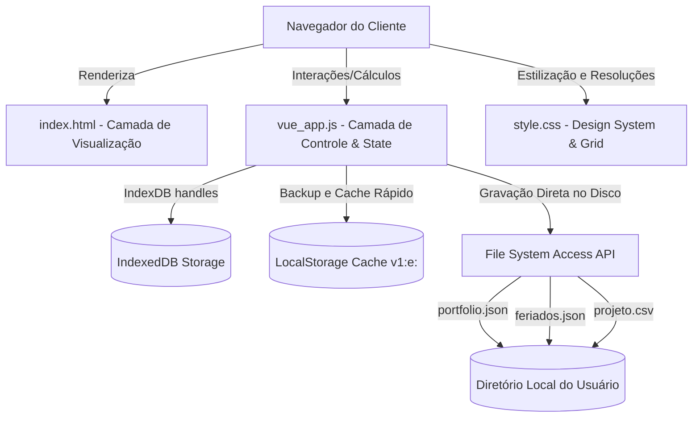
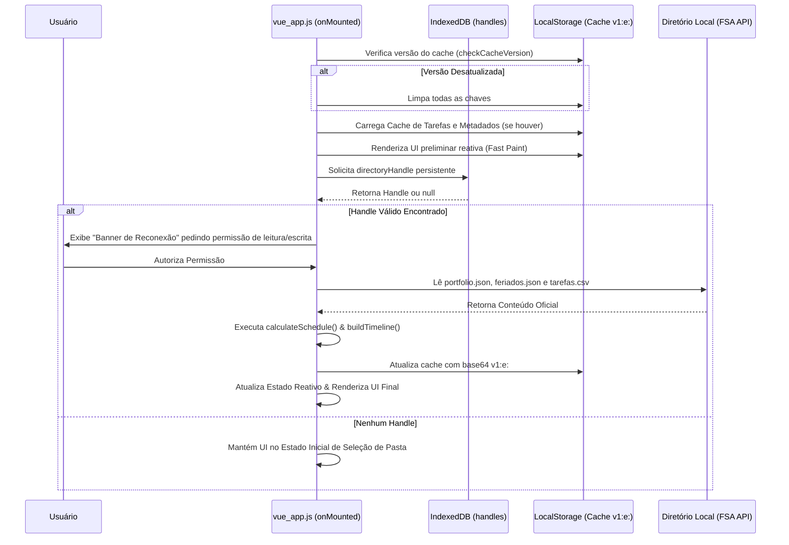

# Arquitetura do Sistema: Visão Geral

Este documento descreve a topologia de arquitetura, decisões estruturais de design e a filosofia do **ProjectGantt**, uma ferramenta corporativa de gerenciamento de projetos baseada no modelo **Local-First**.

---

## 1. Filosofia de Design: Local-First Monolítico

O **ProjectGantt** foi projetado sob a premissa de privacidade absoluta, velocidade de resposta instantânea e soberania de dados do usuário. O sistema opera inteiramente no navegador web do cliente final (Client-Side Only), dispensando servidores de aplicação backend ou bancos de dados em nuvem estruturados sob a tutela da aplicação.

### Princípios Fundamentais:
1. **Soberania dos Dados:** O usuário escolhe uma pasta local em sua própria máquina de trabalho para hospedar o repositório de projetos (portfólio). Toda gravação de arquivo ocorre de maneira transparente e direta nesse diretório local.
2. **Execução Desconectada:** O sistema é plenamente funcional offline. Caso não haja conexão de rede externa, todas as funcionalidades básicas de gerenciamento de cronograma, previsão, exportação e visualização continuam operacionais.
3. **Sem Servidores Externos:** A comunicação de rede limita-se à carga inicial dos scripts estáticos (HTML/CSS/JS) e bibliotecas CDN caso não estejam no cache local do navegador.
4. **Desempenho Instantâneo:** Por rodar em RAM no processo principal do navegador, o tempo de latência de cálculos de dependências e renderizações de tela aproxima-se de 0ms.

---

## 2. Visão Geral da Topologia do Sistema

A arquitetura do sistema é monolítica-leve, distribuída em três blocos interdependentes no lado do cliente:

---

## 3. Descrição dos Módulos Principais

### Camada de Estrutura e Apresentação (`index.html`)
* **Responsabilidade:** Contém o template reativo contendo o grid horizontal do Gantt, a tabela lateral de dados das tarefas com resizador dinâmico de largura, e todos os modais de configurações de projetos, feriados, importação/exportação e wizards.
* **Dependências Diretas:**
  * **Vue 3 (via CDN):** Renderização reativa e manipulação reativa do DOM.
  * **html2canvas:** Captura de tela do elemento container do Gantt para exportação gráfica.
  * **jsPDF:** Compilação e estruturação de relatórios em formato PDF com layout customizado.

### Camada de Lógica de Negócios e Controle (`vue_app.js`)
* **Responsabilidade:** Concentra o estado de aplicação reativo global, o motor de cálculo topológico de dependências (`calculateSchedule`), o algoritmo de previsão em cascata (`runForecast`), a sanitização de arquivos lidos/salvos e os conectores das APIs do navegador.
* **Componentes Chave:**
  * **Topological Dependency Solver:** Processa a ordem de precedência técnica das atividades (FS e SS) recursivamente.
  * **Integridade das Operações de Arquivo:** Gerenciador de leitura e escrita resiliente à falha (criação automática de backups `.bak` e fallback seguro para memória volátil do navegador).
  * **IndexedDB Store Controller:** Persiste o token seguro do descritor de diretório (`directoryHandle`) para evitar requisições de permissão repetidas a cada recarga.

### Camada de Design System e CSS (`style.css`)
* **Responsabilidade:** Define as variáveis de estilo (design tokens), o layout do grid sincronizado entre a tabela e as barras, animações micro-interativas para hover, tooltips inteligentes, e a responsividade dinâmica para suportar diferentes tamanhos de monitor.

---

## 4. O Fluxo de Controle e Estados na Inicialização

O ciclo de vida de inicialização da aplicação segue uma sequência rígida para garantir que o cache de memória seja pintado antes do acesso real ao disco físico, proporcionando uma experiência premium sem telas brancas.

---

## 5. Histórico de Decisões de Design (ADR)

Para facilitar a manutenção técnica, relembramos a principal decisão histórica de design:
* **Descontinuação do Vite/Vuetify (SFC):** O projeto cancelou a refatoração para compilação baseada em empacotadores e componentes Vuetify. O monolito reativo baseado em **Vue 3 CDN** + **Vanilla CSS** foi mantido devido ao seu tempo zero de inicialização, facilidade de auditoria e flexibilidade de rodar via `file://` sem complexidade de dependências NPM de compilação.
* **Uso do Servidor de Desenvolvimento:** O `Vite` contido no arquivo `vite.config.js` é mantido apenas como um servidor de arquivos estáticos local superveloz durante o desenvolvimento, mitigando as restrições de contexto seguro do navegador para APIs de arquivo no ambiente `localhost`.
