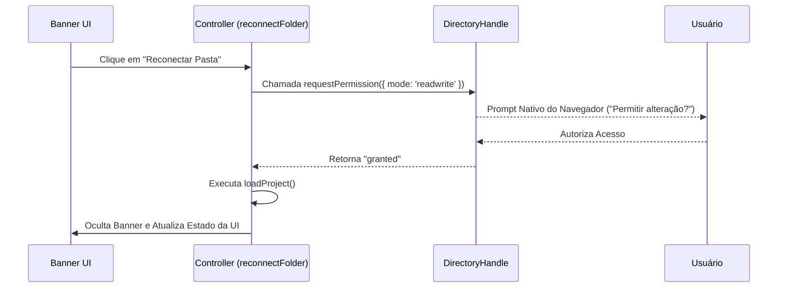

# Camada de Persistência e Acesso Local (Backend Local-First)

Este documento descreve os detalhes técnicos de implementação da camada de dados do **ProjectGantt**, mapeando como a aplicação gerencia o acesso ao disco do usuário, persiste permissões em IndexedDB e garante a resiliência operacional por meio de backups automatizados.

---

## 1. Acesso Físico ao Disco: File System Access API

Por ser um sistema **Local-First**, a persistência real ocorre de forma descentralizada. Em vez de chamadas de API REST/GraphQL para um servidor remoto, a aplicação utiliza a especificação moderna **File System Access API** do navegador para interagir com arquivos no sistema de arquivos do sistema operacional do usuário.

### Fluxo de Escrita em Disco
Quando uma alteração é acionada na interface (ex: salvamento de tarefa, atualização de feriado, ou configuração do projeto):
1. O sistema cria uma rotina de segurança gerando uma cópia de backup (`.bak`) do arquivo existente em disco.
2. O sistema solicita um descritor de arquivo físico com a flag `{ create: true }`.
3. É instanciado um objeto de escrita (`WritableStream`) via `handle.createWritable()`.
4. Os dados atualizados em formato string (JSON ou CSV com codificação UTF-8 e marcação **BOM** - `\ufeff`) são transmitidos diretamente para o stream.
5. O stream é fechado (`close()`), persistindo a alteração física imediatamente.

### Mecanismo de Tolerância a Falhas e Retry
A função `saveFileToDisk(filename, content, retries = 1)` implementa um loop ativo de tentativas com retardo (delay) automático para atenuar problemas temporários de bloqueio de escrita (exemplo: arquivo aberto em outro editor pelo usuário):

```javascript
for (let attempt = 0; attempt <= retries; attempt++) {
  try {
    const handle = await directoryHandle.value.getFileHandle(filename, { create: true });
    const writable = await handle.createWritable();
    await writable.write('\ufeff' + content);
    await writable.close();
    return true;
  } catch (err) {
    if (attempt < retries) {
      await new Promise(r => setTimeout(r, 500)); // Aguarda 500ms
      continue;
    }
    // Gravação final de contingência...
  }
}
```

---

## 2. Persistência de Tokens de Acesso em IndexedDB

O navegador web, por motivos de segurança, perde qualquer descritor de arquivo (`FileSystemHandle`) mantido em variáveis comuns ao reiniciar ou recarregar a aba da aplicação. 

Para contornar esse comportamento e oferecer uma experiência premium contínua, o **ProjectGantt** implementa persistência de referências em **IndexedDB**.

### Banco de Dados e Parâmetros:
* **Database Name:** `GanttProjectDB`
* **Version:** `1`
* **Object Store Name:** `handles`
* **Key Name:** `projectFolder`

### Funções de Interface:
* `getDB()`: Cria ou conecta-se de forma assíncrona ao banco IndexedDB local utilizando promises.
* `saveHandleToDB(handle)`: Salva o descritor ativo `directoryHandle` do tipo `FileSystemDirectoryHandle` sob a chave `projectFolder`.
* `loadHandleFromDB()`: Recupera o descritor na inicialização da página.

### O Fluxo de Reconexão de Permissão
Mesmo que o descritor seja recuperado do IndexedDB, o navegador requer uma interação voluntária do usuário para revalidar a autoridade de escrita na pasta por razões de sandboxing de segurança. A aplicação exibe o **Banner de Reconexão de Pasta** na parte superior da UI:



---

## 3. Rotina de Backup Inteligente (`.bak`)

Antes de realizar qualquer gravação por cima de arquivos cruciais de controle, a função `backupFile(filename)` lê o estado anterior daquele arquivo em disco e cria uma réplica de segurança com a extensão `.bak`. 

### Arquivos Cobertos:
* `portfolio.json` -> Gerado `portfolio.json.bak`
* `feriados.json` -> Gerado `feriados.json.bak`
* `<nome_do_projeto>.csv` -> Gerado `<nome_do_projeto>.csv.bak`

Esta estratégia impede a perda irreversível de dados em casos de falta de energia da máquina, falha catastrófica de escrita ou corrupção acidental de cabeçalhos pelo navegador web.

---

## 4. Fallback de Contingência (LocalStorage Local)

Caso a aplicação seja executada em navegadores desatualizados que não suportem a especificação nativa File System Access API (ou se o usuário negar explicitamente as permissões de gravação local), a aplicação ativa sua camada de contingência transparente.

### Mecanismo de Funcionamento:
1. **Identificação:** Se `'showDirectoryPicker' in window` retornar falso, o sistema sinaliza que operará sob cache de navegador.
2. **Leitura local:** `readFileFromDisk(filename)` busca o dado correspondente em localStorage, utilizando a chave indexada `'gantt_fs_' + filename`.
3. **Escrita local:** `saveFileToDisk` grava a string de forma ofuscada via base64 em localStorage e atualiza um índice centralizado chamado `gantt_fs_index` para rastreabilidade de arquivos simulados no navegador.
4. **Indicação Visual:** A UI exibe mensagens notificando que o projeto está sendo executado sob o armazenamento local do navegador e instrui o uso da ferramenta nativa de **Exportação de Dados** para gravação manual no disco de trabalho real.
