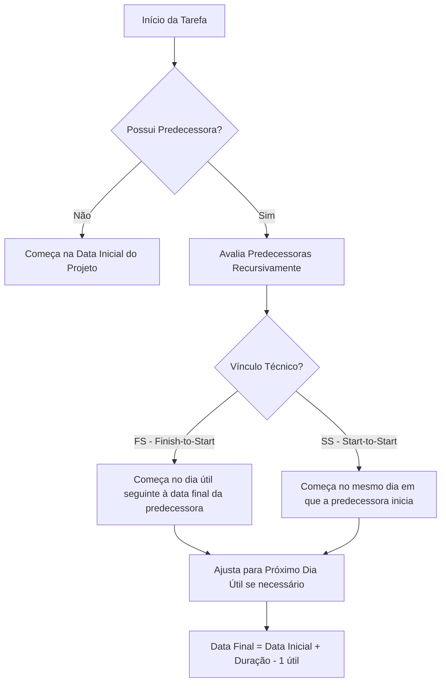

# Motor de Agendamento e Regras de Previsão (Scheduling Engine)

Este documento descreve de forma matemática, lógica e algorítmica o funcionamento do motor de cálculo de cronograma do **ProjectGantt**, mapeando como a função `calculateSchedule()` resolve dependências, ajusta calendários e propaga atrasos em cascata.

---

## 1. Calendário e Restrições de Dias Úteis

O tempo físico de execução de cada tarefa baseia-se exclusivamente em **Dias Úteis**. O motor rejeita fins de semana e feriados para alocação de trabalho real, deslocando automaticamente qualquer sobreposição para o próximo dia útil disponível.

### Validação de Dia de Trabalho (`isWorkingDay`):
Seja $D$ uma data qualquer. $D$ é considerada um dia útil de trabalho ($\text{WorkingDay}(D) = \text{true}$) se, e somente se, atender cumulativamente às seguintes condições:

1. **Restrição de Fim de Semana:**
   $$\text{DayOfWeek}(D) \notin \{0, 6\} \quad \text{(onde 0 = Domingo e 6 = Sábado)}$$
2. **Restrição de Feriado:**
   $$\text{getLocalISOString}(D) \notin \text{holidaysMap}$$

### Algoritmo de Adição de Dias Úteis (`addWorkingDays`):
Para somar $N$ dias úteis a partir de uma data inicial $S$:

$$\text{addWorkingDays}(S, N) = \text{Data final deslocada após pular exatamente } N \text{ dias que não correspondam a feriados ou finais de semana.}$$

Se a data resultante do início da tarefa cair em um dia de descanso ou feriado, ela é deslocada recursivamente para a frente:
```javascript
while (!isWorkingDay(t.start)) t.start = addDays(t.start, 1);
```

---

## 2. O Solucionador Topológico Recursivo (`calculateSchedule`)

O motor de cronograma resolve as dependências dinamicamente por meio de um algoritmo de **Ordenação Topológica com Resolução em Profundidade (DFS)**. 

### Estados de Data das Tarefas (`dateSource`):
Ao inicializar o solucionador, as atividades podem assumir quatro estados de definição temporal:
1. **`locked` (Bloqueada):** O usuário preencheu explicitamente campos de datas planejadas (`plannedStart` e `plannedEnd`). O motor respeita essas datas como fixas e suspende os cálculos dinâmicos para esta tarefa.
2. **`calculated` (Calculada):** A data da tarefa foi definida dinamicamente baseando-se na data inicial do projeto ou na finalização do seu predecessor sem intercorrências reais.
3. **`forecast` (Previsão):** Indica que a tarefa sofreu impacto de atraso ou adiantamento propagado em cascata por atividades predecessoras reais.

---

## 3. Resolução de Dependências e Vínculos Técnicos

Para tarefas não bloqueadas (`dateSource !== 'locked'`), o motor analisa os predecessores declarados na coluna `Predecessora` e o tipo de vínculo técnico configurado na coluna `Tipo` (`FS` ou `SS`).



### A. Vínculo Término-para-Início (FS - Finish-to-Start)
O sucessor pode iniciar apenas após a conclusão do predecessor.
* **Cálculo da Data de Referência:**
  Seja $P$ a tarefa predecessora de uma tarefa $T$. 
  Se $P$ possui uma data real de término preenchida pelo usuário (`realEnd`), o motor adota essa data como referência prioritária, projetando o início de $T$ para o próximo dia útil subsequente:
  
  $$\text{T.start} = \text{addWorkingDays}(\text{P.realEnd}, 1)$$
  
  Caso $P$ não tenha sido finalizada, mas tenha iniciado (`realStart`), o término projetado de $P$ é recalculado com base em sua duração original:
  
  $$\text{P.forecastEnd} = \text{addWorkingDays}(\text{P.realStart}, \text{P.duration} - 1)$$
  $$\text{T.start} = \text{addWorkingDays}(\text{P.forecastEnd}, 1)$$
  
  Se $P$ não iniciou e não tem datas reais, o sistema projeta o término baseando-se na data calculada de $P$:
  
  $$\text{T.start} = \text{addWorkingDays}(\text{P.start}, \text{P.duration})$$

### B. Vínculo Início-para-Início (SS - Start-to-Start)
O sucessor inicia simultaneamente no mesmo dia de início do predecessor.
* **Cálculo da Data de Referência:**
  $$\text{T.start} = \text{P.realStart} \lor \text{P.start}$$

### Mapeamento de Múltiplos Predecessores:
Se uma atividade $T$ possui múltiplas predecessoras (ex: `predecessor = "1,2"`), o motor resolve todas as predecessoras recursivamente e adota a maior data final resultante como a data inicial de trabalho para $T$:

$$\text{T.start} = \max_{P \in \text{Predecessoras}} (\text{Data de Referência Calculada de } P)$$

---

## 4. Detecção e Resolução de Dependências Cíclicas

Para evitar travamentos de tela por loops infinitos de recursividade (ex: Tarefa 1 depende da Tarefa 2, que por sua vez depende da Tarefa 1), o motor implementa um **Detector de Ciclos Baseado em Rastreamento de Caminho**.

### O Algoritmo de Detecção:
A função `resolve(t, visited)` rastreia os IDs avaliados no ramo de recursão ativo por meio de um conjunto reativo (`Set`).

```javascript
// 2. Cycle detection
if (visited.has(t.id)) {
  t.start = new Date(projStart); // Quebra o ciclo atribuindo data inicial
  t.dateSource = 'calculated';
  return;
}

visited.add(t.id); // Registra nó ativo no caminho de exploração
// ... resolve dependências ...
visited.delete(t.id); // Limpa registro ao retroceder
```

Se o ID visitado já existir no `Set` durante o aprofundamento, o motor:
1. Interrompe a descida recursiva imediatamente.
2. Força a data de início da tarefa sob conflito para coincidir com a data mestre de início do projeto.
3. Permite que o restante do cronograma seja calculado normalmente sem congelar o navegador.

---

## 5. Projeção de Previsões em Cascata (`runForecast`)

A rotina de simulação de previsões (`runForecast`) atua como a ferramenta de inteligência de cenários do ProjectGantt.

Ao ser acionada, ela reavalia o estado de execução real do portfólio de tarefas. Se alguma atividade do meio do cronograma atrasou em sua execução física real (excedendo a estimativa planejada original), o motor recalcula recursivamente o impacto cumulativo desse atraso nas tarefas subsequentes não iniciadas.

O sistema monitora e exibe em tempo real o impacto das alterações:
* Atualiza a propriedade `dateSource` das atividades impactadas para `'forecast'`.
* Exibe alertas visuais destacando se as atividades futuras sofreram desvios.
* Dispara um aviso dinâmico contendo a contagem exata de tarefas reprogramadas para o gerente de projetos coordenar as ações de mitigação.
