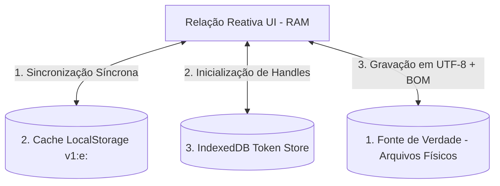

# Esquemas de Banco de Dados e Níveis de Cache

Este documento descreve a infraestrutura de dados multi-nível do **ProjectGantt**, detalhando as estruturas das três camadas operacionais de persistência que trabalham de forma coordenada para conciliar gravação segura local com tempos de resposta instantâneos.

---

## 1. Arquitetura de Dados em Três Níveis (Tier Storage)

O ProjectGantt dispensa bancos de dados relacionais tradicionais rodando em rede (como PostgreSQL ou MySQL). Em seu lugar, implementa um modelo de **Armazenamento Híbrido Reativo Local** dividido em três camadas operacionais distintas:

---

## 2. Nível 1: Fonte da Verdade Física (Diretório Local)

A base conceitual de banco de dados do sistema baseia-se em **Flat Files** relacionais gravados diretamente no disco do usuário via File System Access API.

* **Esquema Relacional do Portfólio:** O arquivo `portfolio.json` atua como a tabela mestre de registros de projetos. Sua chave estrangeira implícita é o campo `tasksFile`, que conecta diretamente com a planilha física `<projeto>.csv`.
* **Esquema de Relações Técnicas:** Dentro da planilha de tarefas do projeto, a coluna `Predecessora` estabelece relações de autorreferência hierárquica (relacionamento muitos-para-muitos recursivo) ligando linhas por meio do campo chave primária `ID`.
* **Esquema de Calendário Corporativo:** O arquivo `feriados.json` representa o catálogo mestre de restrições de calendário compartilhado entre todos os projetos de um mesmo portfólio.

---

## 3. Nível 2: Cache de Renderização Veloz (LocalStorage)

Para oferecer uma experiência de renderização premium (Fast Paint), o sistema não aguarda os callbacks assíncronos das APIs de arquivo do disco para pintar as barras na tela. Ele lê o estado previamente persistido em **LocalStorage**.

### Versionamento de Cache e Expansão
O sistema monitora a compatibilidade dos esquemas guardados localmente com uma constante centralizada de versão (`CACHE_VERSION = 1`).
* **Verificação de Consistência (`checkCacheVersion`):** Se a chave `gantt_cache_version` em LocalStorage divergir da versão ativa, o sistema automaticamente invalida os dados locais via `clearAllCache()` para evitar quebras por estruturas incompatíveis.
* **Chaves de Cache Monitoradas:**
  * `tasks`: Lista serializada de atividades do último projeto carregado.
  * `projectMetadata`: Dados de configuração do projeto ativo.
  * `projectOptions`: Lista de todos os projetos cadastrados no portfólio.
  * `holidaysMap`: Hash table dos dias feriados.
  * `activeProjectName`: Nome chave do projeto ativo na sessão.

### Mecanismo de Ofuscação de Dados (`v1:e:`)
Para impedir a corrupção de caracteres especiais nas chaves de cache e garantir a conformidade dos dados, a aplicação implementa codificação Base64 acoplada com escape de URI.

* **Codificação (`encodeCache`):**
  $$\text{String Codificada} = \text{"v1:e:"} + \text{Base64}(\text{encodeURIComponent}(\text{JSON.stringify}(\text{data})))$$
* **Decodificação (`decodeCache`):** O leitor intercepta a string, verifica a assinatura (`v1:e:` ou a assinatura legada `e:`), remove o prefixo correspondente, e reconverte usando `atob` associado ao `decodeURIComponent`.

---

## 4. Nível 3: Repositório de Identificadores de Acesso (IndexedDB)

Para manter a segurança sandboxed sem forçar o usuário a clicar em caixas de diálogo de abertura de arquivos toda vez que carregar a aplicação, a ferramenta utiliza **IndexedDB** para persistência dos tokens de segurança (descritores).

### Estrutura do IndexedDB (`GanttProjectDB`)

* **Object Store (`handles`):** Uma tabela chave-valor não estruturada criada sob demanda.
* **Tabela de Registros:**

| Chave de Pesquisa (Key) | Tipo de Valor | Conteúdo Persistido | Finalidade Técnica |
|---|---|---|---|
| **`projectFolder`** | `FileSystemDirectoryHandle` | Token interno do descritor de diretório nativo concedido pelo sistema operacional. | Permite revalidar as permissões de acesso e escrita na pasta local do usuário em sessões futuras. |

O uso de promessas encapsuladas (`Promise`) na comunicação assíncrona com o motor IndexedDB garante que o carregamento do descritor ocorra de forma síncrona com o ciclo de vida inicial de montagem do Vue 3.
