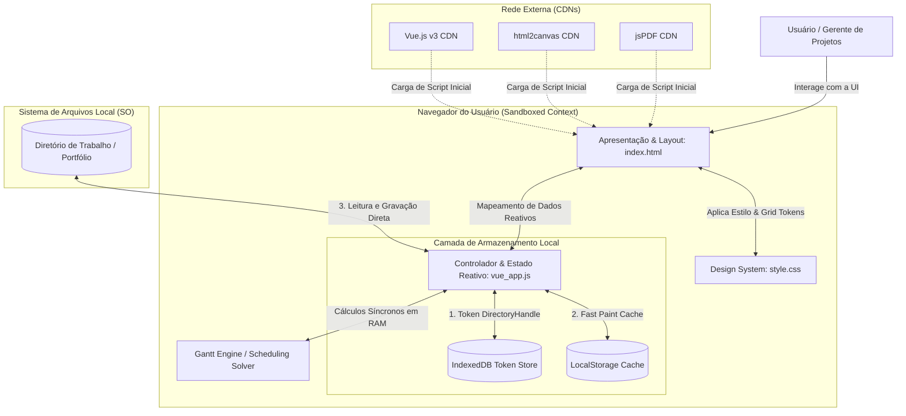
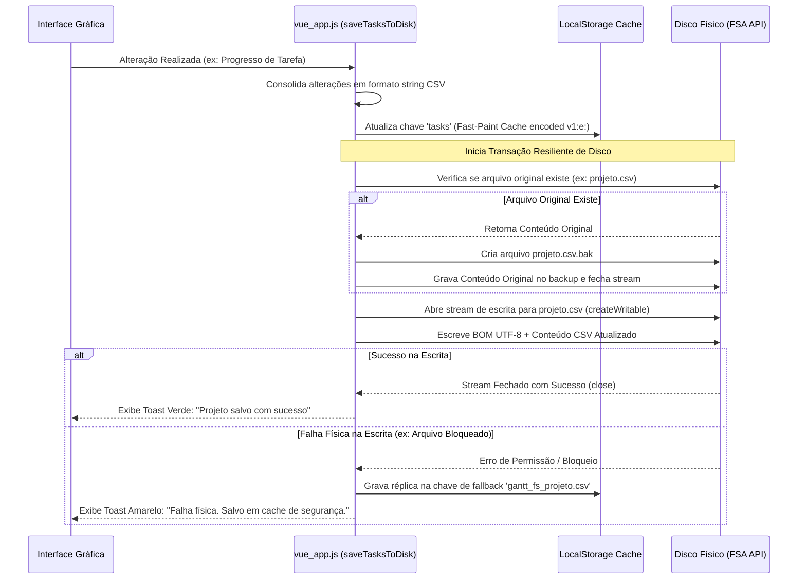
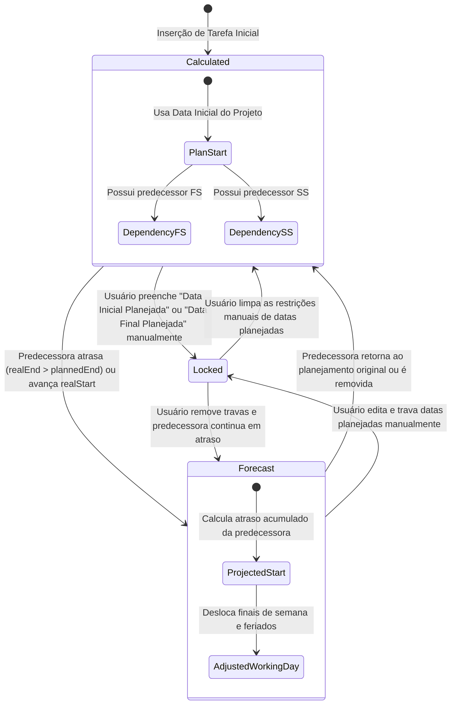
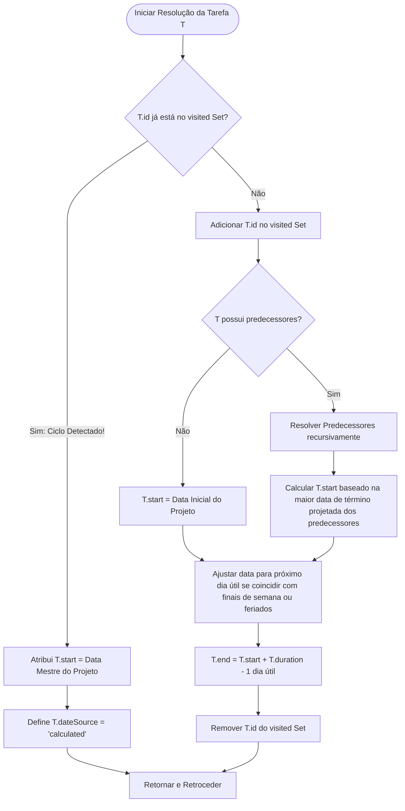
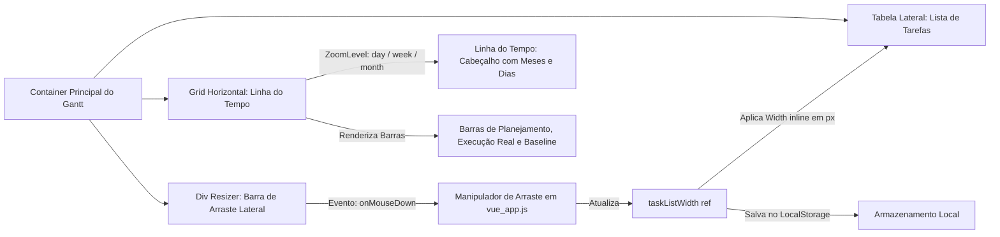

# Catálogo de Diagramas Arquiteturais e Operacionais

Este documento consolida os diagramas arquiteturais e os fluxos de dados do **ProjectGantt**, estruturados em conformidade com o padrão C4 Model e utilizando a sintaxe do Mermaid para facilitar a visualização direta e a evolução contínua da engenharia do software.

---

## 1. Visão Geral do Sistema (C4 Model - Nível 1 & 2)

O **ProjectGantt** opera inteiramente no espaço de isolamento do navegador do usuário final (Client-Side Sandboxing). O diagrama abaixo descreve o contexto do sistema e a relação do navegador com os recursos locais e externos.

---

## 2. Fluxo de Sequência: Ciclo de Salvamento Resiliente com Backups

Quando o usuário realiza qualquer alteração em tarefas, feriados ou metadados de projeto, o sistema aciona uma sequência estruturada para garantir a integridade física dos dados, gerando backups `.bak` antes de qualquer alteração destrutiva no disco.

---

## 3. Máquina de Estados das Datas das Tarefas (`dateSource`)

A inteligência de simulação de cronogramas reside na classificação de estados temporais das tarefas. Cada atividade tem um estado definido dinamicamente pela propriedade `dateSource`:

---

## 4. Fluxo Topológico de Resolução de Ciclos de Dependências

Para evitar travamento de renderização e estouro de pilha por loops infinitos de recursividade nas dependências das tarefas, a função de ordenação topológica executa uma detecção ativa via DFS (Depth-First Search) mantendo um registro no `Set` de nós ativos no caminho visitado.

---

## 5. Arquitetura da Tabela do Grid de Renderização Reativo

Este diagrama ilustra a sincronicidade perfeita do grid horizontal CSS com a tabela lateral de dados das tarefas. O resizer dinâmico ajusta as larguras mantendo a reatividade intacta.

