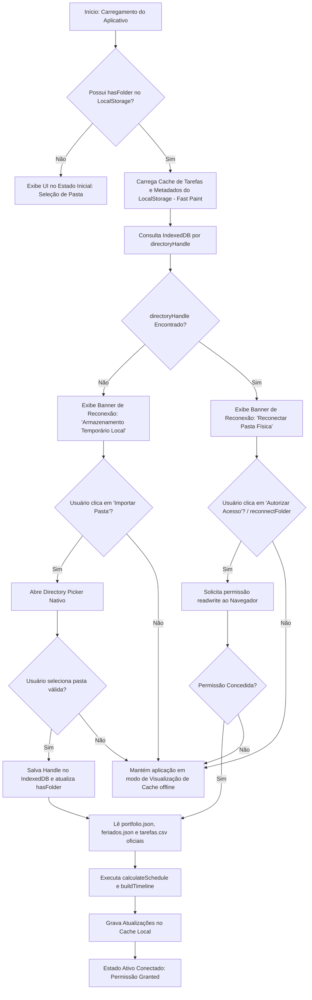
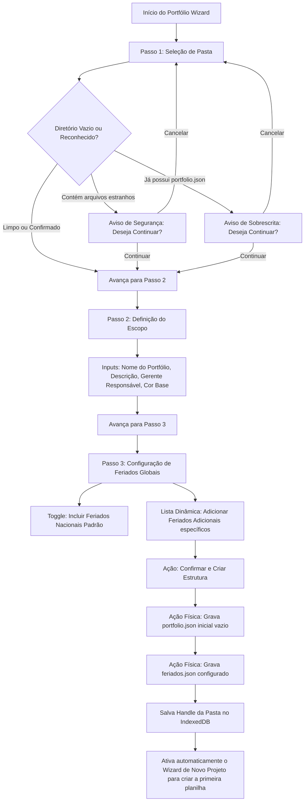

# Fluxos Operacionais e Transições de Estado

Este documento descreve os fluxos lógicos, ciclos de vida de controle e as transições de estado do **ProjectGantt**. Mapeia de forma detalhada o comportamento dinâmico do aplicativo sob diferentes interações do usuário.

---

## 1. Fluxo de Reconexão e Acesso à Pasta do Projeto

Como um sistema Local-First, o gerenciamento do acesso persistente aos arquivos locais de forma não intrusiva é vital para uma experiência de usuário de alta fidelidade. O fluxo abaixo descreve as decisões de contingência e transição de estado da inicialização até o carregamento completo do projeto.



### Detalhes das Transições de Estado do Acesso

| Estado Inicial | Ação / Evento | Estado Resultante | Feedback Visual na UI | Comportamento Interno |
| :--- | :--- | :--- | :--- | :--- |
| `Offline (No Folder)` | Clique em `Selecionar Pasta` | `Granted (Nativo)` | Banner de conexão some; Grid Gantt é renderizado. | `directoryHandle` é instanciado e salvo no IndexedDB; `hasFolder` = `true`. |
| `Offline (No Folder)` | Browser sem suporte FSA API | `Granted (Fallback)` | Exibe toast informando fallback de navegador. | Ativa input HTML multiplo; salva réplicas ofuscadas no LocalStorage. |
| `Cached (Aguardando)` | Clique em `Autorizar Acesso` | `Granted (Nativo)` | Banner verde de sucesso; dados atualizados instantaneamente. | Chama `.requestPermission()`; relê arquivos do disco físico. |
| `Cached (Aguardando)` | Recusa de Permissão | `Cached (Visualização)`| Banner amarelo: "Operando em modo cache offline". | `permissionStatus` = `prompt`; mantém dados do LocalStorage na memória. |

---

## 2. Wizard de Criação de Novos Projetos (Blank / Templates)

O wizard permite instanciar um novo projeto (`projeto.csv`) dentro de uma pasta de portfólio ativa. O processo é estruturado em três passos lineares no modal dinâmico.

### Passos Detalhados do Wizard

```mermaid
sequenceDiagram
    participant U as Usuário
    participant W as vue_app.js (Wizard State)
    participant FS as File System API / Cache
    
    U->>W: Clique em "Novo Projeto" (startNewProjectWizard)
    Note over W: Passo 1: Metadados Básicos<br/>wizardStep = 1
    W-->>U: Exibe inputs de Nome, Gerente e Cor de Destaque
    
    U->>W: Preenche Nome & Avança (nextWizardStep)
    Note over W: Validação: wizardName não pode ser vazio
    Note over W: Passo 2: Datas & Calendário<br/>wizardStep = 2
    W-->>U: Exibe inputs de Data de Início e Toggle de Feriados
    
    U->>W: Define Data & Avança (nextWizardStep)
    Note over W: Passo 3: Escolha do Modelo<br/>wizardStep = 3
    W-->>U: Exibe opções: Em Branco, Desenvolvimento de Software, Engenharia Civil
    
    U->>W: Confirma Criação (confirmCreateProject)
    alt Sem pasta conectada
        W->>U: Abre Directory Picker para vincular pasta do projeto
        U-->>W: Concede pasta
    end
    
    W->>FS: Sanitiza nome do arquivo (ex: "Meu Projeto" -> "meu_projeto.csv")
    W->>FS: Cria feriados.json (se wizardIncludeHolidays for verdadeiro)
    W->>FS: Popula tarefas.csv com dados do template selecionado
    W->>FS: Atualiza portfolio.json adicionando o novo projeto
    
    W->>W: Executa calculateSchedule() & buildTimeline()
    W->>FS: Grava arquivos no disco e atualiza caches locais
    W-->>U: Fecha modal; Exibe Toast de Sucesso; Renderiza novo Gantt
```

### Configuração de Tarefas por Modelo de Template

1.  **Modelo em Branco (`blank`):**
    *   *Tarefa Inicial:* `"Planejamento Inicial"` (Duração: 5 dias, Progresso: 0%, Sem Predecessoras).
2.  **Desenvolvimento de Software (`software`):**
    *   Atividades sequenciais com dependências do tipo FS (Término-Início) e SS (Início-Início):
        1. `Levantamento de Requisitos` (5 dias)
        2. `Arquitetura e Design UI/UX` (Predecessora: 1, 7 dias)
        3. `Desenvolvimento Backend` (Predecessora: 2, 15 dias)
        4. `Desenvolvimento Frontend` (Predecessora: 2, Tipo: SS, 15 dias)
        5. `Testes e Qualidade (QA)` (Predecessoras: 3,4, 6 dias)
        6. `Homologação e Implantação` (Predecessora: 5, 3 dias)
3.  **Engenharia Civil / Construção (`civil`):**
    *   Cadeia crítica linear tradicional:
        1. `Projetos e Licenciamento` (10 dias)
        2. `Terraplenagem e Fundações` (Predecessora: 1, 15 dias)
        3. `Estrutura e Alvenaria` (Predecessora: 2, 25 dias)
        4. `Instalações Elétricas e Hidráulicas` (Predecessora: 3, 12 dias)
        5. `Acabamento e Pintura` (Predecessora: 4, 15 dias)
        6. `Vistoria e Entrega` (Predecessora: 5, 3 dias)

---

## 3. Wizard de Criação do Portfólio de Raiz

O portfólio é a estrutura de nível mais alto do sistema, mapeada fisicamente na pasta de trabalho do usuário. Quando um diretório vazio é selecionado pela primeira vez, o **Wizard de Portfólio** é ativado para guiar o usuário na padronização daquele repositório físico.

### Fluxo Metodológico do Portfólio



---

## 4. Algoritmo de Previsão em Cascata (Cascade Forecast)

O recurso de **Forecast** (Previsão) entra em ação quando há desvios reais no progresso ou datas das atividades de campo, propagando de forma inteligente as datas previstas para as tarefas dependentes à jusante sem sobrescrever as datas planejadas originais da Baseline.

### Ciclo de Propagação do Forecast

```mermaid
sequenceDiagram
    participant U as Usuário
    participant UI as Interface Gantt / Modal de Edição
    participant ENG as scheduling_engine (calculateSchedule)
    participant FS as Gravação Física (resiliente)
    
    U->>UI: Altera Progresso (%) de uma tarefa (ex: 50% em andamento)
    Note over UI: Progresso > 0 ativa data real de início automática<br/>Progresso = 100 ativa data real de término automática
    
    U->>UI: Insere data real (Data_Inicial_Real ou Data_Final_Real)
    U->>UI: Clica em "Salvar" no modal
    
    UI->>ENG: Invoca calculateSchedule(tasks, startDate)
    
    loop Varredura Recursiva DFS
        Note over ENG: Analisa Tarefa Dependente à Jusante
        alt Predecessora concluída com atraso real (realEnd > plannedEnd)
            ENG->>ENG: Desloca Data de Início da tarefa atual para o dia útil posterior ao fim real
            ENG->>ENG: Define t.dateSource = 'forecast'
        else Predecessora em andamento atrasada (Hoje > plannedEnd)
            ENG->>ENG: Calcula fim previsto projetado (realStart + duracao)
            ENG->>ENG: Desloca início da tarefa atual para o dia útil posterior ao fim projetado
            ENG->>ENG: Define t.dateSource = 'forecast'
        }
        Note over ENG: Recalcula prazo final somando duração útil
    end
    
    ENG-->>UI: Retorna lista atualizada com as novas datas
    UI->>FS: Atualiza LocalStorage & salva arquivo tarefas.csv no disco
    UI->>UI: Invoca runForecast() para auditoria de impactos
    
    alt Houve tarefas afetadas
        UI-->>U: Exibe Toast Azul: "Previsão recalculada — N tarefa(s) com forecast atualizado"
    else Sem impactos (atrasos absorvidos pelas folgas)
        UI-->>U: Exibe Toast Verde: "Cronograma recalculado — sem impactos em cascata"
    end
```

> [!NOTE]
> Uma tarefa com datas customizadas travadas pelo usuário (`plannedStart` e `plannedEnd` definidos manualmente em edição) entra em estado de bloqueio (`dateSource = 'locked'`). O motor do agendador recursivo respeita esse bloqueio e não altera as datas da atividade travada, embora propague os eventuais atrasos dela para suas próprias sucessoras.
